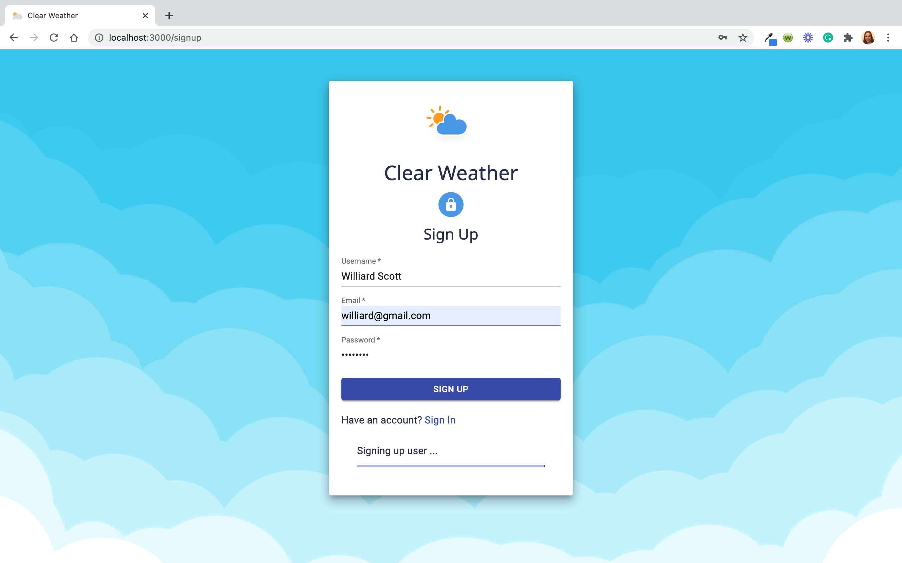
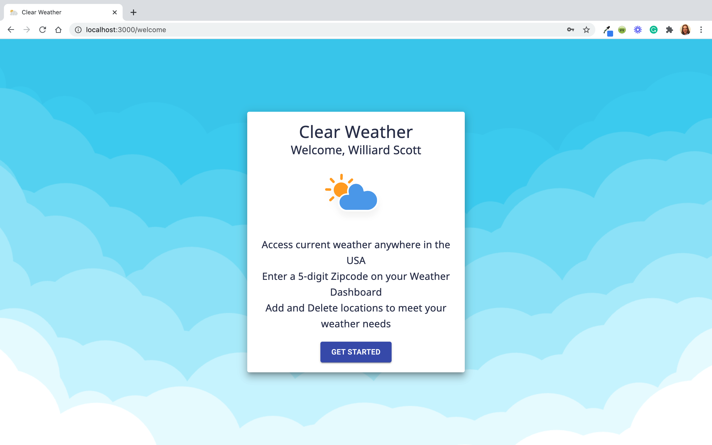
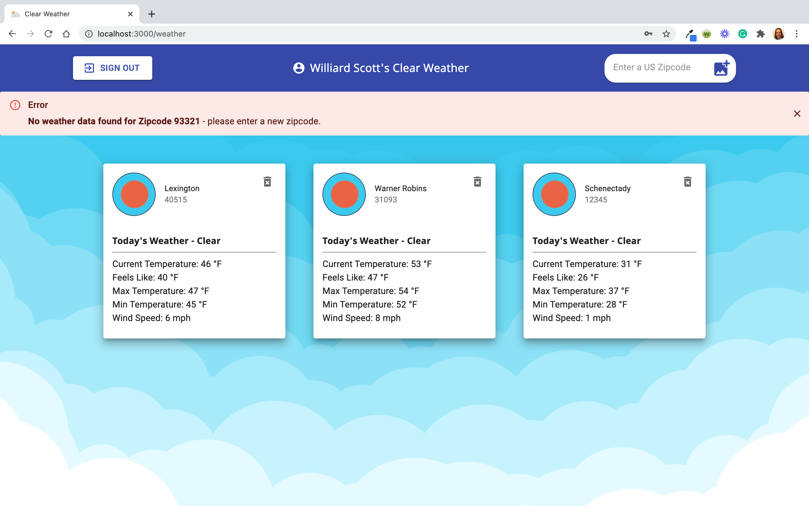
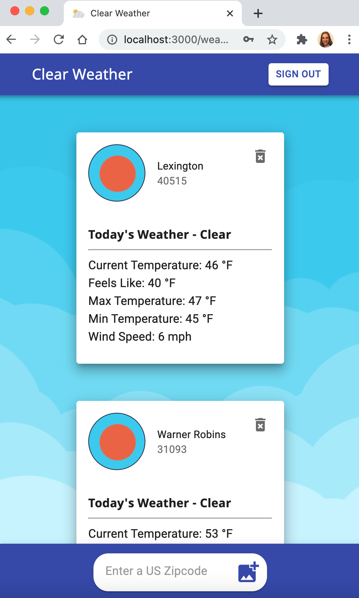

## Clear Weather App

Clear Weather App is a full stack web application which displays current weather data for US zipcodes for authenticated users. Users can add and delete locations. Users and locations are stored in a backend database. The frontend application is built with React, React Router, JavaScript, and Material UI.

### App User Requirements
1. A user can create a new account
2. A user can login to his/her account
3. A user can add a zipcode location
4. A user can delete a zipcode location
5. A user can view current weather information for all his/her locations

## Project Summary

This project was created over a two week period for a coding interview challenge. The frontend application was bootstrapped with Create React App and React Router was added to enable client-side routing. Although I hadn't used it before, I decided to use Material UI for styling to get experience with this popular React UI framework. 

I chose the [Open Weather Map API](https://openweathermap.org/api) for weather data. This free API provided current weather data for locations by different query parameters. I had previous experience accessing this resource and had a developer api key. The backend was bootstrapped with the Lambda School Foundation Java Spring application and implemented OAUTH2 authorization and authentication with the frontend app and users. 

The backend was implemented first to create REST routes for users and locations. The backend application was deployed with Heroku and implemented a PostgreSQL database for data persistence. Routes were tested with Postman before moving on to the frontend app.

My initial plan for the frontend app included a Splash page component, pages for user Signup and Login, and a Weather Dashboard. The Splash, Login, and Signup component pages would be rendered routes not requiring user authentication. The Weather Dashboard component would be rendered as a protected route requiring user authentication accomplished by setting the backend provided access_token to local storage. A logout button on the user's Weather Dashboard would remove the access_token from local storage and the backend token store. 

I revised this plan to remove the Splash page, not wanting to require users to navigate through two screens to access weather data. In addition I added a Welcome component as a user onboarding when a user completes a signup to create a new account. I created nested components rendered inside the Weather Dashboard including a Header with an input for a new location and a Weather Card for individual location data. 

The forms for the Login and Signup components provided a great introduction to Material UI components, icons, and makeStyles. I created forms that would be responsive and work well on all screen sizes. Because the Heroku backend server may "go to sleep" between uses and may require as long as 30 seconds to "wake up", I added a Material UI progress animation component to indicate the process for the user. I added a simple weather animation to each component for additional style.

Once successfully logged in, new users are routed using the React Router useHistory hook to the Welcome component for an app introduction and then to the user's Weather Dashboard. Returning users are routed directly to the Weather Dashboard.

To manage application state I decided to use the React's Context API with the useContext hook. This allowed me to provide a single object of data to the app's components and access the individual props needed in individual components without implementing prop drilling. User and location state and the state setters were initially created with the useState hook in the top level App component and then used and updated within the nested components.

Login and Signup components set the username to the initial state and location state variables were set within the Weather Dashboard. UseEffect hooks were used within the Weather Dashboard to access the backend api for the userid and user's locations and to call the Open Weather Map API for weather data when the user's locations change. Additional functions were created to add and delete locations, making needed api calls to update the backend db and the local application state.

I made the decision to use US zipcodes as the query paramter for the Open Weather Map API. Zipcodes allowed for a simpler, easier to validate input. This limited this initial version to US locations represented by 5-digit zipcodes.

I created a Header component for the Weather Dashboard using the Material UI AppBar. The header included an account icon, the user's username from the application state, an input for a 5-digit zipcode with an icon button to submit, and a logout button to end the user's session and route back to the Login page. 

Making the Header component responsive proved a challenge. After trying many options, I eventually decided to provide an entirely different layout on small screens. I researched a way to conditionally render React components based on screen size and found a solution that used a state boolean variable to get the initial window size, and set an event listener for page resize. I implemented a useEffect with a dependency array to monitor changes in screen size and call a function to set a state variable which controlled which AppBar layout was rendered. Screens less than 768px would render the mobile AppBar layout. I decided to divide the mobile AppBar into two AppBars for small screens. The top bar would display the app name and the logout button and the bottom bar would be fixed to the bottom of the screen and provide the user zipcode input and add location icon button. This separation of inputs provided much better user interaction on small screens.

Additional challenges were encountered in handling zipcode inputs already held in state and in handling invalid zipcodes, those which did not return a location from the Open Weather Map API. My initial setup added the location to the backend api for every 5-digit numerical value the user entered. I updated the state logic to ensure that invalid zipcodes were removed from the database. I added a Material UI Alert component to provide user feedback for invalid zipcode inputs. Non-numeric inputs with a length not equal to five were handled within the input form.

Individual location information was rendered using Weather Cards composed of Material UI components. Open Weather Map API provided an icon which was incorporated into the Card Avatar and Typography components were used to render current weather data. I added the JavaScript math.round() function to make weather data values integers.

## Under Construction - Automated Testing

Next steps are to add End-to-End testing for user interactions on the frontend app using Cypress and backend unit and integration testing for controllers and services with Spring for method and code coverage. 

## Project Deployment
The front end application is deployed with Netlify and the backend application is hosted on Heroku.

[Clear Weather App Live Site](https://clear-weather.netlify.app/)

[Clear Weathers App Back End GitHub Repo](https://github.com/ginabethrussell/apax_weather_backend/edit/main/README.md)

## Project Screen Shots

### Desktop and Tablet Interface: 

##### New User Sign Up

##### New User Welcome Page

##### User Dashboard

### Mobile Interface: 

##### User Dashboard

  

### Installation and Setup Instructions

Clone the repository. You will need `node` and `npm` installed globally on your machine.  

Installation:

`npm install`  

To Run Test Suite:  

`npm test`  

To Start Server:

`npm start`  

To Visit App:

`localhost:3000/`  

